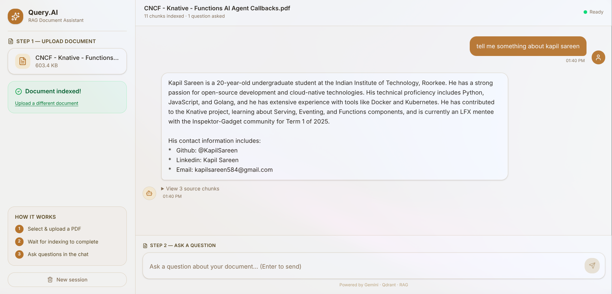
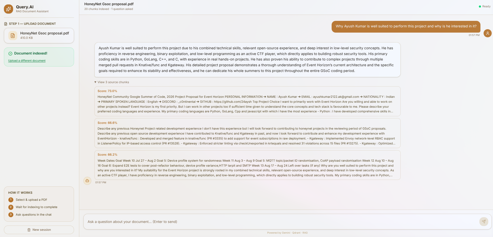
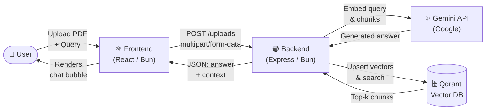
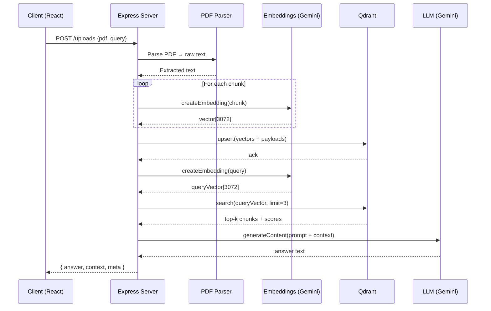
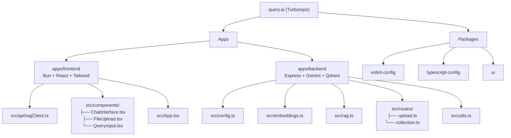

# Query.AI — RAG Document Assistant

> **Upload a PDF. Ask a question. Get a grounded AI answer.**

Query.AI is a Retrieval-Augmented Generation (RAG) chatbot that lets you have a conversation with any PDF document. It uses Google Gemini for both embeddings and language generation, and Qdrant as the vector database for semantic search.

---

## Screenshots

| Document indexed & answer generated | Source chunks revealed |
|---|---|
|  |  |

---

## Architecture

### High-Level Request Flow



---

### RAG Pipeline (Backend Detail)



---

### Monorepo Structure



---

## Tech Stack

| Layer | Technology |
|---|---|
| Frontend | React 19, Bun, Tailwind CSS v4 |
| Backend | Express 5, Bun runtime |
| Embeddings | Gemini `gemini-embedding-exp-03-07` (3072-dim) |
| LLM | Gemini `gemini-2.5-flash-lite` |
| Vector DB | Qdrant (managed cloud) |
| Monorepo | Turborepo |

---

## Getting Started

### Prerequisites

- [Bun](https://bun.sh) ≥ 1.3
- A [Google AI Studio](https://aistudio.google.com/app/apikey) API key (Gemini)
- A [Qdrant Cloud](https://cloud.qdrant.io) cluster

### 1 — Clone & Install

```bash
git clone https://github.com/your-username/query.ai.git
cd query.ai
bun install
```

### 2 — Configure Environment

```bash
cp apps/backend/.env.example apps/backend/.env
```

Fill in your values in `apps/backend/.env`:

```env
GEMINI_API_KEY=your_gemini_api_key
QUADRANT_API_KEY=your_qdrant_api_key
CLUSTER_ENDPOINT=https://your-cluster.qdrant.io
```

### 3 — Create the Qdrant Collection (one-time)

Once the backend is running, call this endpoint once to create the vector collection:

```bash
curl http://localhost:3001/create-collection
```

### 4 — Run in Development

```bash
# From the repo root — starts both frontend and backend via Turborepo
bun run dev

# Or run individually:
cd apps/backend  && bun --hot index.ts    # → http://localhost:3001
cd apps/frontend && bun run dev           # → http://localhost:3000
```

## License

MIT
